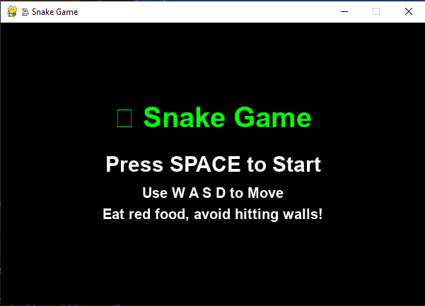

# Snake-Game-Using-Python
🐍 Snake Game (Python + Pygame) A simple Snake Game built with Pygame.  Control the snake using W, A, S, D  Eat the red food to grow and score points  You have 3 lives – avoid hitting walls or yourself!  Includes start screen, score display, and game-over screen  Perfect for beginners learning Python game development.

# 🐍 Snake Game (Python + Pygame)

A simple and fun **Snake Game** built with [Pygame](https://www.pygame.org/).  
Eat the food, grow longer, and avoid crashing into the walls or yourself!  

## 🎮 Features
- Classic Snake mechanics  
- Controls with **W, A, S, D**  
- **3 lives** – respawn until all lives are gone  
- Score tracking  
- Start screen and game over screen  

## 📸 Screenshots
### Start Screen  


### Gameplay  


## ⚙️ Installation
Make sure you have Python installed (3.8+ recommended).  

1. Clone this repository:
   ```bash
   git clone https://github.com/your-username/snake-game.git
   cd snake-game


